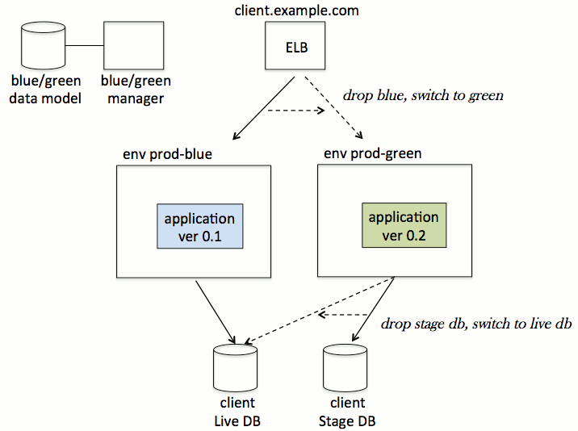
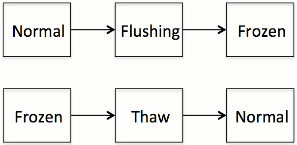
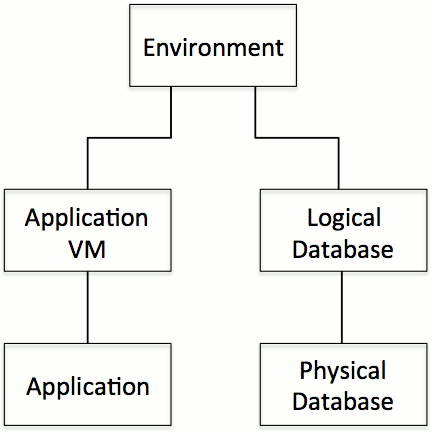

# bluegreen-manager

bluegreen-manager is a tool for managing blue/green deployment of software applications in a cloud environment.  The purpose is to make it easier, safer, and faster to do a production release of new application functionality, including a convenient rollback option in case of a "no-go" release decision.

The concept of blue/green deployment is as follows: Your live application is blue.  On the side, you spin up a production-level upgraded staging system, which users can't see -- this is green.  You take all the time you need to test the green system, and it can be during regular business hours or whenever users are using the blue system, blissfully unaware of the impending release.  When green is fully tested, you "flip a switch" (DNS or Load Balancer) and now green is the new live environment.  At your leisure, you can teardown the old blue system.  Alternatively, if you ran into problems during green test, then instead of go-live you would do a rollback, tearing down the green, and users would never know anything happened.



On your next production release, your live app is green, and you bring up a stage app which is blue.  The colors for live and stage flip back and forth each time.

## Requirements

- JRE 1.6+
- Maven
- AWS account and credentials
- Blue/green-compliant app to control ...try bluegreen-demo-app


## Command-line usage
```
BlueGreenManager argument format: <jobName> <parameters>

Job 'stagingDeploy'
Description: Spins up a new stage env, including a new application vm, 
             its target application, and a test copy of the live 
             database.  Temporarily freezes the live application during
             database copy.
Required Parameters:
  --liveEnv <envName>
      Specify the live env so we can freeze it, replicate its db, and 
      base stage from it.
  --stageEnv <envName>
      The stage env is where we will spin up a new vm, a test db copy, 
      and deploy packages.  It must not exist beforehand, because this 
      job creates it.
  --dbMap [ <liveLogicalName> <stagePhysicalInstName> ]+
      We will copy the live logical database(s) to a stage physical 
      database having the requested instance name.
  --packages <list of stage pkgs>
      List of packages to deploy to stage, which are DIFFERENT from what
      is on the live env.  Use full package names as they will be 
      recognized by your package repository.

Job 'goLive'
Description: Reassigns liveness from the old env to the new env.  When 
             done, the old env is frozen and removed from the live load 
             balancer's vm pool.
Required Parameters:
  --oldLiveEnv <envName>
  --newLiveEnv <envName>
  --fixedLB <loadBalancerName>
      Name of a fixed live load-balancer currently hosting the old live
      application.  We keep the LB fixed in place, register the new 
      live application vm with this LB, and deregister the old live
      application vm.

Job 'teardown'
Description: Spins down and destroys the requested env, including the
             application vm and test database.
Required Parameters:
  --deleteEnv <envName>
      The env which is to be deleted.  (Take great care to specify the
      correct env!)  For a rollback (no goLive), specify the stageEnv.
      For cleanup after a goLive, specify the oldLiveEnv.  Either way,
      the target env is linked to the test database.
  --stopServices <list of services>
      Specify services running on the deleteEnv which we should
      try to shutdown gracefully prior to vm deletion.

Common Optional Parameters:
  --noop
      No-op means print out what this job WOULD do, without taking any
      action that would leave side effects.  We will make read-only
      queries to env services to gather useful information.
  --force
      Force job to attempt all tasks, instead of skipping tasks that 
      were successful in the last recent try.
```

## Jobs and tasks
We have defined three jobs.  A job runs a sequence of tasks.  Future development will make this more configurable and offer more options.

#### Staging Deploy Job
1. Freeze
1. RdsSnapshotRestore
1. Thaw
1. SshVmCreate
1. LocalShell: createStageEnv
1. LocalShell: deployPackages
1. RegisterApplication
1. SmokeTest

The job starts by "freezing" the live application so that it stops writing to its live database (Amazon RDS MySQL).  The next task uses the RDS api to clone the live database, producing a stage (test) database.  If your live db is huge you may wish to spin off a subset instead of a full clone, but the point is to make a data sandbox where you can run stage integration tests with production-quality data without having to worry about actually writing to production.  After cloning, the job "thaws" the live application, meaning it can resume write operations to the live db.

Then a new stage VM spins up (Amazon EC2).  To make the VM ready to run your application may require environmental configuration and package deployments that are beyond what can be controlled by this tool.  So the job spawns a local shell to execute a script you provide.  (Specify it in bluegreen-manager.properties.)  You can pass variables to the script taken from the blue/green environment data model.  When this is done, the job registers the stage application in the data model and smoke-tests it to make sure the application's host:port are accessible.

When this is done you have a private stage environment.  Step aside from bluegreen-manager and perform integration tests until you are satisfied with it.  Take all the time you want.  If the stage environment looks good then proceed to Go Live, otherwise do a Rollback.

#### Go Live Job
1. Freeze: newLive
1. Freeze: oldLive
1. LocalShell: swapDatabases
1. SwapDatabases
1. Discovery
1. SmokeTest
1. FixedElbFlipEc2
1. Thaw

The job starts by freezing both the new live application and the old live application.  ("New live" was formerly called "stage.")  Now we swap the database links in the two applications.  There's a local shell task, allowing you to run a custom swap script; and a blue/green specific task that swaps the links in the data model.

Next comes discovery, where the bluegreen-manager pokes the new live application and tells it to rediscover its database.  The live app was pointing to a stage (test) db and discovers the live db.  The application is responsible for doing whatever it takes to reset its use of the database.  The job runs another smoke-test to make sure the application is still functioning.

Now the fun part, in which we flip the EC2 instances: add new live to the load balancer (Amazon ELB), remove old live.  Assumes constant DNS pointing to the ELB.  Now the new live application is accessible and the old live is not.  Thaw the new live application and leave the old live frozen.

### Teardown Job
1. LocalShell: shutdownApplications
1. RemoteShell: deleteEnv
1. SshVmDelete
1. RdsInstanceDelete
1. ForgetEnvironment

There are two kinds of teardown: "teardown commit," where you follow a successful goLive by destroying the old live application; and "rollback stage," where your stage integration test convinced you to leave the live environment unchanged, and you want to destroy the stage environment.  The work is the same for both kinds, because the net effect is that an environment gets deleted.  Just be very careful to specify the right environment for deletion!

The job begins with shell tasks, giving you the opportunity to shutdown applications gracefully and do any needed custom environment cleanup.  Then it requests deletion of the target VM and the stage database.  Finally it "forgets" the target environment by removing it from the blue/green data model.

---

## Installation and configuration
Summary:

1. Build the manager jar
1. Customize manager properties
1. Create the manager database
1. Bootstrap a client environment

Build from source:

```
mvn clean package
```

Customize the [properties](#Properties) file:

```
cp src/main/resources/bluegreen-manager.properties target/dependency/.
vi target/dependency/bluegreen-manager.properties
```

See descriptions of the individual properties below.

Create a database instance for use by bluegreen-manager.  Initialize the blue/green data model schema by running `bluegreen_schema.sql`.  (Alternatively, you can initialize the schema by temporarily uncommenting hibernate.hbm2ddl.auto=create and setting jpaVendorAdapter generateDdl=true in persist.xml, and running the program once with no arguments, i.e. `java -jar bluegreen-manager.jar`.)

Identify a client application that you wish to have controlled by the bluegreen-manager.  It needs to implement the [blue/green api](#ClientApi).  We have provided the bluegreen-demo-app as an example.

Bootstrap your first environment by inserting records into the blue/green data model.  Here you are defining the connection info for your client application, to support client database discovery, and so the bluegreen-manager knows how to reach out and touch the client application.  Take a look at `bluegreen_bootstrap.sql` for how to do this.  Fill in values for vm hostname, demo database url, etc.

Now, assuming the client application is running, you are ready to start a blue/green deployment with `java -jar bluegreen-manager.jar stagingDeploy <args>`.

### <a name="Properties"></a>Properties
You will need to specify the following in dependency/bluegreen-manager.properties:

#### General properties

* *bluegreen.datasource.discovery*: Database connection parameters for the bluegreen db, which manages the blue/green data model.
* *bluegreen.aws*: AWS account credentials.
* *bluegreen.sshtarget*: Used by SshVm and Remote tasks, to authenticate with other VMs (peer to the bluegreen-manager) that perform custom environment work.

#### Shell commands

* *bluegreen.sshvmcreate, sshvmdelete*: Used by SshVmCreate, SshVmDelete.  Specify a command to be executed (e.g. AWS EC2 script) for VM creation and deletion.  Also the regexps used to evaluate the command output.
* *bluegreen.shellConfig.createStageEnv*: During stagingDeploy, this command registers the new environment outside the bluegreen-manager.  If you don't have any other system that needs to know about the new environment, then you can stub it out with a no-op command like "echo".  
* *bluegreen.shellConfig.deployPackages*: During stagingDeploy, this command deploys packages to the stage application VM after its initial launch.
* *bluegreen.shellConfig.swapDatabases*: During goLive, bluegreen-manager updates its data model by switching the database pointers of the stage and live applications.  Depending on your external environment you may also wish to perform some custom housekeeping, in which case you would specify it here as a local command.
* *bluegreen.shellConfig.shutdownApplications*: During teardown, gracefully shuts down applications before the VM is terminated. 
* *bluegreen.shellConfig.deleteEnv*: During teardown, this is an opportunity to deregister the target environment outside the bluegreen-manager, if applicable.

Other properties can be left at their default values, specified in the bluegreen-manager.properties which is built into bluegreen-manager.jar.


---

## <a name="ClientApi"></a>Client API
A blue/green-compliant application implements the following restful endpoints, so the bluegreen-manager can control it.

(In these examples we've shown a url prefix '/rest/bluegreen', however you are free to use any other prefix.  For example instead of '/rest/bluegreen/discoverDb', you could use simply '/discoverDb' or '/some/other/path/discoverDb'.  Make sure to specify the prefix in the data model for the application.)

* `POST /rest/bluegreen/login`

Authenticates bluegreen-manager with the app, so that it can be authorized to access the other restful resources shown here.

* `PUT /rest/bluegreen/discoverDb`

Informs the app that it should re-discover its database.  Called during goLive.

* `GET /rest/bluegreen/dbFreezeProgress`

Returns json describing the app's progress towards freeze or thaw.

* `PUT /rest/bluegreen/enterDbFreeze`

Tells the app to freeze.

* `PUT /rest/bluegreen/exitDbFreeze`

Tells the app to thaw.  (Assuming it is currently frozen.)

## Freeze modes

A blue/green-compliant application supports the database freeze process:



In Normal mode, the application is functioning normally and is free to write to its database.

In Flushing mode, the application no longer accepts new write operations, and is in the process of finishing current write operations.  The database is in the process of entering read_only mode.

In Frozen mode, the application and database are read only.  This is the state when the bluegreen-manager is free to take a snapshot of the live database (stagingDeploy), flip application vms in the ELB (goLive), or tear down the old live environment (teardown).

In Thaw mode, the database is exiting read_only mode and then the application is in the process of re-enabling write operations.


## Data model

bluegreen-manager maintains a data model of the environments it controls.



Environment: A cluster of related application vm and database resources.

Application VM: A VM on which blue/green applications execute.

Application: An application which supports the blue/green client api.

Logical Database: A datastore accessed by the application.

Physical Database: Actual connection parameters to the datastore, and a flag to indicate whether the database instance is live or stage.

---

## Run your first blue/green deployment

Prerequisites:

* Install bluegreen-manager (see above)
* Install bluegreen-demo-app (separate project)

With the prerequisites done, we'll say the demo app is up and running.  Let's say you have given its environment the name "bgdemo-blue", using a logical database called "bgdemodb" that points to a physical RDS instance called "bgdemo-live" (with RDS parameter group "mysql55-tuned-bgdemo-live").  You have bootstrapped the blue/green data model with that environment information.  The app started up, discovered its database, and is functioning in normal mode.  You are ready to start the blue-to-green deployment flow.

Pretend you are the developer of bluegreen-demo-app and you are making a change you want to release to production, to replace the current live application.  Edit ScannerService.java and change `DEMO_VERSION` to some new string.  (The demo web ui displays that string.)  Edit pom.xml and change `<version>` as well.  Use mvn to build a new war package, let's call it bluegreen-demo-app-1.1-SNAPSHOT.war.

Invoke the bluegreen-manager to do a stagingDeploy and create a stage environment, we'll call it "bgdemo-green".  You can invoke this directly on a command-line, or do it in your Continuous Integration server (Jenkins, Teamcity, etc):

```
java -jar bluegreen-manager.jar stagingDeploy \
   --liveEnv bgdemo-blue --stageEnv bgdemo-green \
   --packages bluegreen-demo-app,bluegreen-demo-app-1.1-SNAPSHOT.war \
   --dbMap bgdemodb bgdemo-stage
```

Where the live app uses a database instance called 'bgdemo-live', the stage app will use a copy named 'bgdemo-stage'.  The stage vm will receive the unreleased application (version 1.1) using the package deployment command-line you've specified in bluegreen-manager.properties.

Launching new instances in EC2 and RDS could take a while.  Check the log output to see the hostname of your new staging vm.

When that's done, step aside from bluegreen-manager for a while to perform your own integration test on the staging environment.  Let's say you are satisfied with the results and are ready for Go Live.  Invoke this command-line:

```
java -jar bluegreen-manager.jar goLive \
   --oldLiveEnv bgdemo-blue --newLiveEnv bgdemo-green \
   --fixedLB bgdemolb 
```

This part goes pretty quickly.  When it is done, stage has become live.  The ELB named 'bgdemolb' now serves requests only to the new live application.

Now cleanup by tearing down the old Amazon resources:

```
java -jar bluegreen-manager.jar teardown \
   --deleteEnv bgdemo-blue \
   --stopServices httpd,tomcat
```
This deletes the EC2 of bgdemo-blue, the test RDS database named bgdemo-stage, and the associated RDS parameter group.  In the above example command we also requested graceful shutdown of some services (httpd and tomcat) before terminating the EC2 instance.


---

## References

[BlueGreenDeployment](http://martinfowler.com/bliki/BlueGreenDeployment.html), Martin Fowler, 2010.

[Continuous Delivery](http://www.amazon.com/dp/0321601912), Jez Humble and David Farley, 2010.  Chapter 10.

[Implementing Blue-Green Deployments with AWS](http://www.thoughtworks.com/insights/blog/implementing-blue-green-deployments-aws), Danilo Sato, 2013.

## Creator
[Daniel Kranowski](http://www.bizalgo.com/contact/)

## License
bluegreen-manager is released under the MIT License.  See LICENSE for details.
